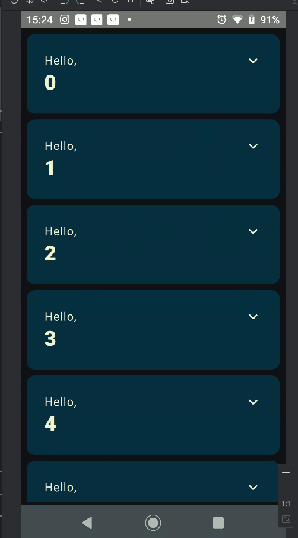

# 📘 Basics Codelab – Jetpack Compose

This project was developed as part of the **“Jetpack Compose Basics”** codelab provided by Google.  
The goal is to demonstrate the fundamental concepts of building modern Android UIs using **Jetpack Compose**.

---

## 📸 Preview



---

## 🚀 Features Implemented

- **Onboarding screen** displayed only at the first launch.
- Scrollable list of 1000 items using **LazyColumn**.
- Each item rendered inside a **Card** component.
- Cards include **expand/collapse** functionality with dynamic text.
- Smooth animations using `animateContentSize()`.
- Proper **state management** with `rememberSaveable`.
- Material 3 **theming**, supporting both light and dark modes.
- Multiple **Preview** annotations to visualize UI components in Android Studio.

---

## 🧩 Project Structure

### **MainActivity**
Initial entry point of the application. Sets up the theme and defines the main UI through `setContent`.

### **MyApp**
Controls the app flow between the onboarding screen and the greetings list based on state.

### **OnboardingScreen**
Displays a welcome message and a "Continue" button.  
Once pressed, the screen transitions to the list view.

### **Greetings**
Displays a list of 1000 strings (0 to 999) using `LazyColumn`.

### **Greeting / CardContent**
Each greeting is displayed as a Card with:
- A title ("Hello")
- The index as a highlighted name
- Expandable text section
- An icon button to toggle expansion

### **Theme**
Defines Material 3 color schemes for light and dark modes.

### **Previews**
UI components can be previewed without running the app through:

- `GreetingPreview` (light and dark mode)
- `OnboardingPreview`
- `MyAppPreview`

---

## 🛠️ Technologies Used

- **Kotlin**
- **Jetpack Compose**
- **Material 3**
- **Android Studio**
- **Compose Animation APIs**

---

## 📦 How to Run

1. Clone the repository:
```bash
git clone https://github.com/YOUR-USER/YOUR-REPO.git
````

2. Open the project in **Android Studio**.

3. Run the app on a physical device or emulator:

```
Run → Run 'app'
```

---

## 📚 Codelab Reference

[https://developer.android.com/codelabs/jetpack-compose-basics](https://developer.android.com/codelabs/jetpack-compose-basics)
